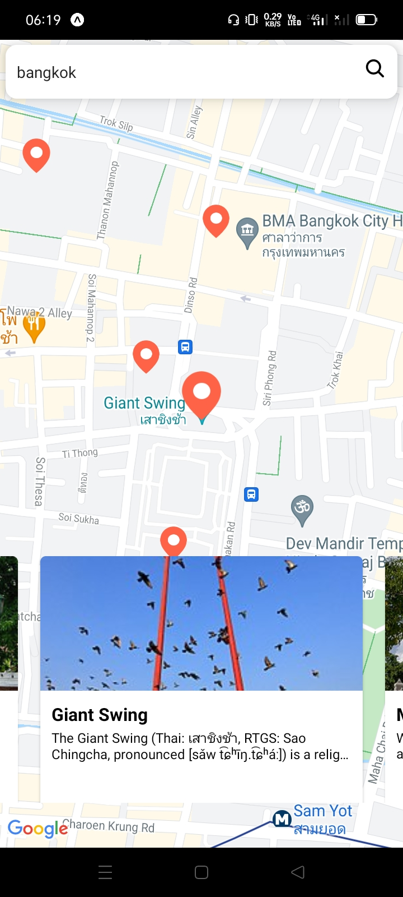
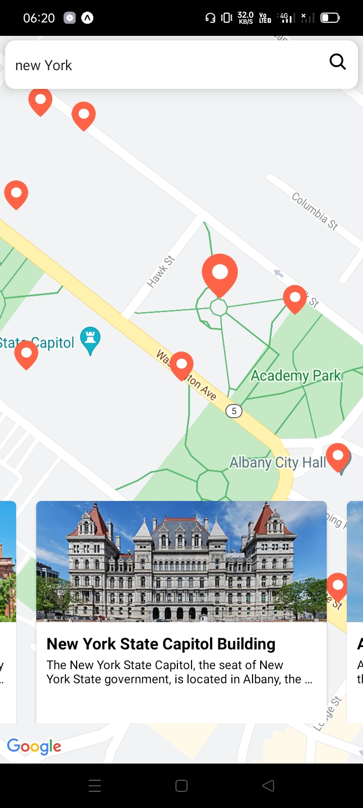

# Nearby - Temukan lokasi terdekat yang belum anda ketahui
Nearby merupakan applikasi untuk menemukan tempat tempat yang dapat anda kunjungi disekitar anda.

  

  

  

## Feature Applikasi
- Mencari tempat menggunakan search input
- Melihat detail tempat

## Teknologi yang digunakan
- React Native
- Server api from https://api.opentripmap.com
